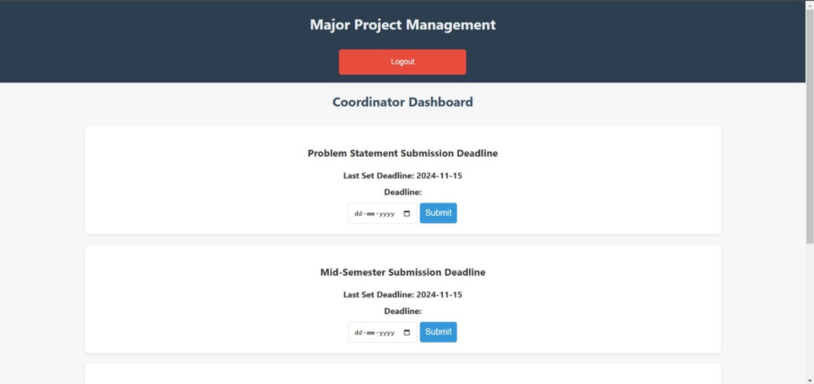
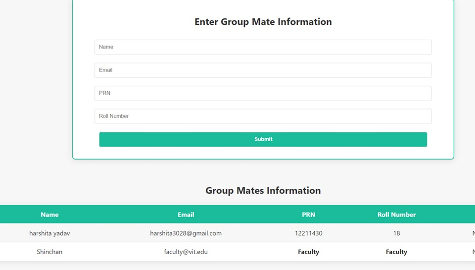
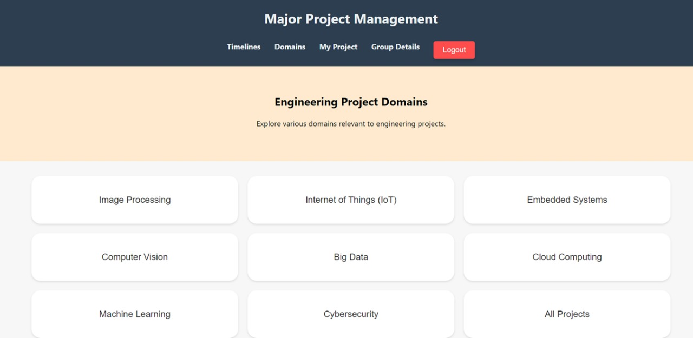
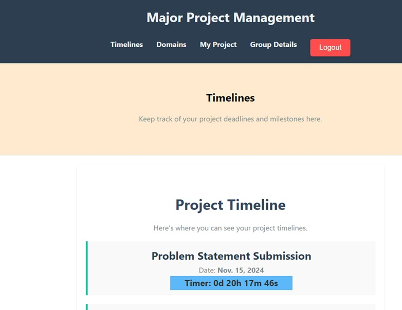
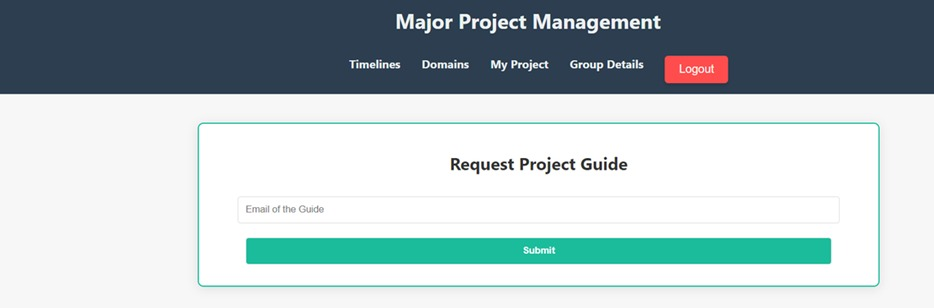
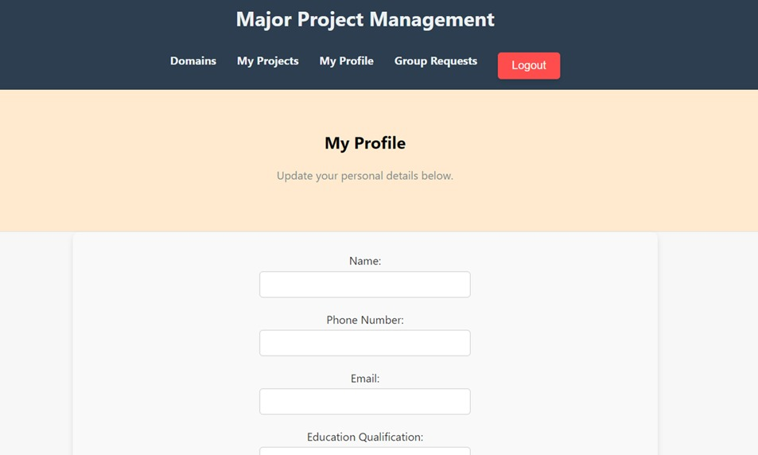
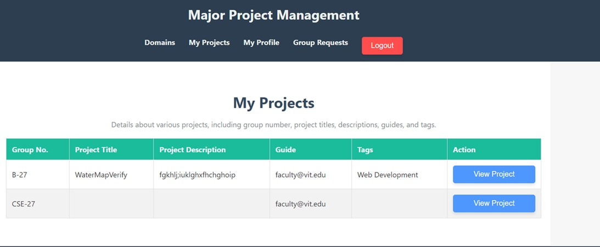

# Project Management System

## 📌 Introduction
The **Project Management System** is a web application designed to streamline the process of managing major academic projects.  
It helps differentiate projects based on domains and enables quick and easy uploads for students.  
The system promotes seamless collaboration, regular updates, and progress tracking throughout the project lifecycle.  

Professors and supervisors can monitor project development timelines, verify the uniqueness of submissions, and provide specific remarks to improve the work.

---

## 🛠 Technology Stack
- **HTML** – To design the frontend skeleton.
- **CSS & Bootstrap** – To enhance the visual appeal of the frontend.
- **SQLite** – For storing the project data.
- **Django** – To implement the backend of the system.

---

## ❗ Problem Statement
**Current Situation:**  
There is a lack of a centralized, easy-to-use platform for managing projects for different subjects.

**Challenges:**
- Difficulty in tracking project timelines, tasks, and team collaboration.
- Existing tools are either too complex or not tailored for educational environments.

**Need:**  
A user-friendly, intuitive solution that addresses the specific needs of academic project management.

---

## 🎯 Objectives
- Create a web application that simplifies project management in a college setting.
- Enhance collaboration among students and faculty.
- Provide tools for real-time tracking of tasks, deadlines, and milestones.
- Design an intuitive interface that ensures ease of use for all users.

---

## 📂 Implementation

### 1️⃣ Student View
- Upload new projects.
- View and track project progress.
- Collaborate with team members.

### 2️⃣ Teacher View
- Review submitted projects.
- Provide grades, feedback, and remarks.
- Track project timelines and updates.

### 3️⃣ Coordinator View
- Assign teachers to projects.
- Oversee project allocation and domain categorization.
- Monitor the entire project database.

---

| View                           | Description                                                     | Image                                                    |
| ------------------------------ | --------------------------------------------------------------- | -------------------------------------------------------- |
| **Coordinator Dashboard**      | Coordinator interface for managing project allocation.          |                |
| **Coordinator Timeline View**  | Coordinator’s view of the project timeline.                     |                 |
| **Groupmate Form**             | Form for students to input group member details.                |               |
| **Home Page**                  | Landing page with navigation options.                           |                             |
| **Project Timeline**           | Timeline view of ongoing projects.                              |           |
| **Project Guide Request Form** | Students request a teacher to guide their project.              |  |
| **Teacher Profile**            | Teacher’s personal profile page.                                |                    |
| **Teacher Dashboard**          | Teacher’s interface for reviewing projects and giving feedback. |        |


## 🚀 How to Run the Project Locally

```bash
# 1️⃣ Clone the repository
git clone <repository_url>
cd Project-Management-System

# 2️⃣ Create and activate a virtual environment
python -m venv env
source env/bin/activate   # On Windows: env\Scripts\activate

# 3️⃣ Install dependencies
pip install -r requirements.txt

# 4️⃣ Run database migrations
python manage.py makemigrations
python manage.py migrate

# 5️⃣ Start the development server
python manage.py runserver

# 6️⃣ Access the application in browser
# http://127.0.0.1:8000/
